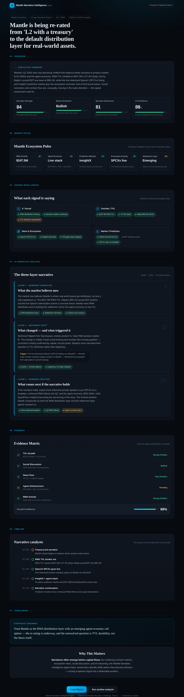
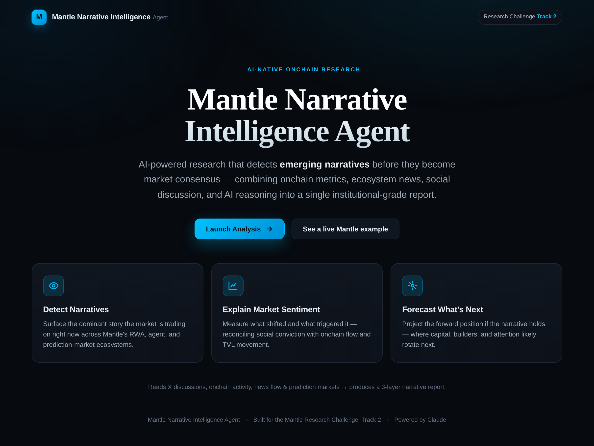
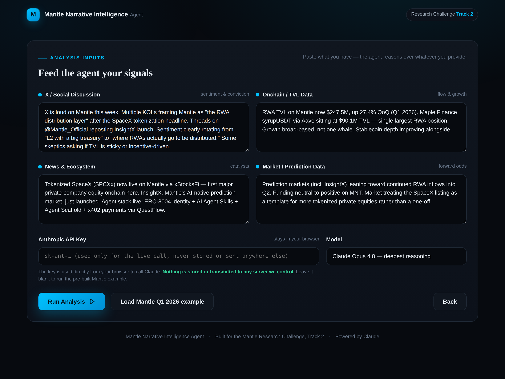

# Mantle Narrative Intelligence Agent

An AI-powered research platform built for the **Mantle Research Challenge — Track 2**.
It detects, explains, and forecasts the narratives shaping the Mantle ecosystem by
combining AI reasoning with onchain, social, news, and market intelligence.

> **Most Track 2 submissions track TVL. This one tracks the *story* markets move on
> before the numbers confirm it** — exactly the "spot the trend shaping the market"
> angle Mantle's brief calls a winning approach.



## What it does

You paste four kinds of signal — **X / social**, **onchain / TVL**, **news &
ecosystem**, and **market / prediction** data — and the agent produces a single
institutional-grade research report structured like a Delphi / Messari note:

| Section | Purpose |
|---|---|
| **Overview** | Executive summary + a summary bar of four KPIs |
| **Market Pulse** | Narrative-weighted read of each Mantle ecosystem pillar |
| **Source Intelligence** | Each input distilled into directional signal chips |
| **AI Narrative Analysis** | The three-layer narrative (below) |
| **Evidence Matrix** | Why the AI reached its conclusion, with an overall confidence score |
| **Timeline** | The catalyst sequence that shaped the current read |
| **Conclusion** | Strategic takeaway + "Why This Matters" |

### The three narrative layers
1. **Dominant Narrative** — what the market believes right now.
2. **Sentiment Shift** — what changed and what specifically triggered it.
3. **Forward Position** — what comes next if the narrative holds.

### The four KPIs
**Narrative Strength · Market Sentiment · Narrative Momentum · AI Confidence**

## Mantle ecosystem awareness

The agent is primed to recognize and reference Mantle-specific primitives when the
sources support it: **RWA TVL, Maple Finance / syrupUSDT via Aave, xStocks / tokenized
equities (SpaceX SPCXx), InsightX (AI-native prediction market), QuestFlow, ERC-8004
agent identity, AI Agent Skills, Agent Scaffold, and x402 payments** — positioning
Mantle as the distribution layer for RWAs and the settlement layer for the agent economy.

## Run it

It's a single self-contained `index.html` — no build step, no dependencies.

```bash
open index.html          # macOS
# or just double-click the file, or serve it:
python3 -m http.server    # then visit http://localhost:8000
```

- **Live mode:** paste your own sources, enter an Anthropic API key, and hit **Run
  Analysis**. The key is used directly from your browser to call Claude and is never
  stored or sent to any server we control.
- **Demo mode (no key needed):** click **See a live Mantle example** → **Run Analysis**.
  This runs the built-in **Mantle Q1 2026** dataset (RWA TVL $247.5M / +27.4% QoQ,
  Maple syrupUSDT $90.1M, live SpaceX SPCXx tokenization, InsightX launch) so judges
  can always see full output.

Default model is **Claude Opus 4.8** (Sonnet 5 / Haiku 4.5 selectable). The frontend
calls the Anthropic Messages API and constrains Claude to a strict JSON contract that
forces the three-layer structure and signal chips.

## Design

Dark, focused, single-purpose — Mantle's `#00C2FF` blue identity, a serif display face
for an institutional-research feel, an analyst-style "thinking" sequence, and a report
that reads top-to-bottom like a research note rather than an exchange terminal.

## Screenshots
| | |
|---|---|
|  |  |
